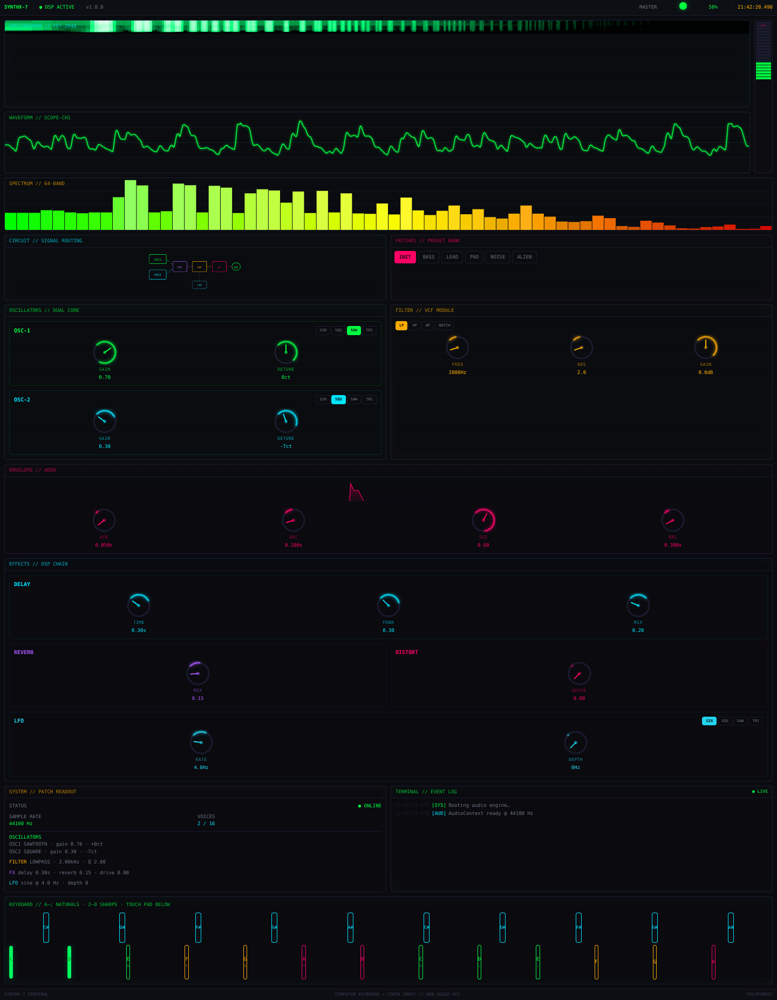

# SYNTHX-7 · Modular Synthesis Terminal

> A dual-oscillator subtractive synthesizer that runs entirely in your browser — built with **React**, **TypeScript**, **Vite**, and the **Web Audio API**.

**▶ [Launch the live demo](https://zazieproductions.github.io/synthx-7-modular-synthesis-terminal/)**



SYNTHX-7 is a playful, terminal-styled take on a hardware modular synth. Two oscillators feed a resonant filter and an ADSR envelope, then pass through delay, reverb, distortion, and an LFO before hitting a soft limiter. Everything runs in real time with zero backend — just a static site and your browser's audio engine.

[](LICENSE)
[](.nvmrc)
[](https://github.com/zazieproductions/synthx-7-modular-synthesis-terminal/actions/workflows/ci.yml)

---

## Features

- **Dual oscillators** — sine, square, sawtooth, and triangle, each with independent gain and ±50-cent detune.
- **Resonant filter** — lowpass, highpass, bandpass, and notch with cutoff, resonance (Q), and gain.
- **ADSR envelope** — with a live curve preview.
- **FX chain** — feedback delay, convolution reverb, and soft-clipping distortion.
- **LFO** — routes to the filter cutoff with selectable waveform, rate, and depth.
- **Polyphonic voice engine** — up to 16 voices with oldest-note stealing.
- **Four visualizers** — oscilloscope, 64-band spectrum, waterfall spectrogram, and a true-RMS level meter with peak hold.
- **Factory preset bank** — INIT, BASS, LEAD, PAD, NOISE, ALIEN.
- **Computer-keyboard + touch input** — playable without a MIDI controller.
- **Safe audio startup** — explicit user gesture, autoplay-policy resume, stuck-note prevention on tab blur, and a soft limiter for gain staging.
- **Accessible controls** — knobs are real `role="slider"` elements with full keyboard support.

## Stack

| Concern  | Technology                                            |
| -------- | ----------------------------------------------------- |
| UI       | React 19, Tailwind CSS 4                              |
| Language | TypeScript 5 (strict)                                 |
| Build    | Vite 7                                                |
| Audio    | Web Audio API (no runtime audio dependency)           |
| Testing  | Vitest, React Testing Library, Playwright             |
| Linting  | ESLint 9 (type-aware), Prettier, EditorConfig         |
| CI/CD    | GitHub Actions (quality checks + GitHub Pages deploy) |

> **Note on Tone.js** — the initial release listed Tone.js as a dependency but never imported it; the synth runs on the native Web Audio API. Rather than wrap a fixed-architecture synth in a large third-party framework, the engine was hardened directly on Web Audio and the dead dependency was removed.

## Controls

### Keyboard mapping

Press the **INITIALIZE AUDIO ENGINE** button once, then play:

| Notes (white keys) | Computer key |     | Notes (black keys) | Computer key |
| ------------------ | ------------ | --- | ------------------ | ------------ |
| C4                 | `A`          |     | C#4                | `2`          |
| D4                 | `S`          |     | D#4                | `3`          |
| E4                 | `D`          |     | F#4                | `5`          |
| F4                 | `F`          |     | G#4                | `6`          |
| G4                 | `G`          |     | A#4                | `7`          |
| A4                 | `H`          |     | C#5                | `9`          |
| B4                 | `J`          |     | D#5                | `0`          |
| C5                 | `K`          |     | F#5                | `=`          |
| D5                 | `L`          |     |                    |              |
| E5                 | `;`          |     |                    |              |

On touch screens a two-row pad appears in place of the keybed.

### Knobs

Every knob is keyboard-operable:

- `↑` / `↓` / `←` / `→` — fine adjust
- `Page Up` / `Page Down` — coarse adjust
- `Home` / `End` — jump to minimum / maximum
- Double-click — reset to the parameter default

## Architecture

The codebase is organised so the audio engine, React state, and UI never leak into each other:

```
┌─────────────────────────── React layer ───────────────────────────┐
│  components/            state/                 hooks/             │
│  panels · visualizers   SynthProvider           useCanvasRenderer │
│  keyboard · controls    (engine → context)                        │
└───────────────────────────────┬───────────────────────────────────┘
                                │ typed API
┌───────────────────────────────▼───────────────────────────────────┐
│  audio/SynthEngine  ·  dsp  ·  notes  ·  constants                │
│  (framework-agnostic, unit-tested in isolation)                   │
└───────────────────────────────────────────────────────────────────┘
```

### Signal chain

```
OSC1 ─► gain ─┐
               ├─► envelope ─► filter ─► distortion ─► dry ──────────┐
OSC2 ─► gain ─┘                             ├─► delay ─► wet ─► mix bus
                                            └─► reverb ─► wet ─┘
mix bus ─► master ─► spectrum analyser ─► limiter ─► scope analyser ─► out
                                                        ▲
                                             LFO ─► filter cutoff
```

A single dry path with per-effect wet sends avoids the double-dry-path gain error present in the original implementation, and a soft limiter before the destination guards against clipping at high drive settings.

### Project structure

```
src/
├── audio/            # Engine, DSP helpers, note/frequency math
│   ├── SynthEngine.ts
│   ├── dsp.ts
│   └── notes.ts
├── components/
│   ├── panels/       # Oscillator, Filter, Envelope, Effects
│   ├── visualizers/  # Waveform, Spectrum, Spectrogram, LevelMeter
│   ├── keyboard/     # Computer-keyboard + touch keybed
│   ├── ControlKnob.tsx
│   └── ...           # StatusBar, PatchSelector, TerminalLog, etc.
├── constants/        # Theme tokens, version, live-demo URL
├── hooks/            # Shared canvas renderer
├── state/            # Provider, defaults, parameter specs, presets
├── types/            # Shared domain models
└── utils/            # Pure formatting & math helpers
```

## Getting started

Requires **Node.js ≥ 20**.

```bash
npm install
npm run dev        # start the dev server
npm run build      # type-check + production build
npm run preview    # serve the production build locally
```

### Scripts

| Script                 | Purpose                                        |
| ---------------------- | ---------------------------------------------- |
| `npm run dev`          | Start the Vite dev server with HMR             |
| `npm run build`        | Type-check (`tsc -b`) and build for production |
| `npm run preview`      | Preview the production build                   |
| `npm run lint`         | ESLint (type-aware)                            |
| `npm run format`       | Prettier write                                 |
| `npm run format:check` | Prettier check (CI)                            |
| `npm run typecheck`    | TypeScript project references                  |
| `npm run test`         | Vitest unit/component tests                    |
| `npm run test:watch`   | Vitest in watch mode                           |
| `npm run e2e`          | Playwright smoke test (builds + serves)        |
| `npm run check`        | format + lint + typecheck + test + build       |

## Testing

Unit and component tests run under Vitest with jsdom:

```bash
npm run test
```

The Playwright smoke test boots the production bundle in headless Chromium, starts the audio engine, and asserts the interface is interactive:

```bash
npx playwright install chromium   # one-time browser download
npm run e2e
```

The README screenshots are generated from the running app (never mocked):

```bash
npm run build && node scripts/capture-screenshots.mjs
```

In restricted-network environments where the Playwright CDN is unreachable,
`scripts/ensure-chromium.mjs` extracts an npm-packaged Chromium build and
prints a path you can pass via `PLAYWRIGHT_EXECUTABLE_PATH`.

## Deployment

The site is a fully static bundle and deploys to **GitHub Pages** via
[`.github/workflows/deploy.yml`](.github/workflows/deploy.yml) on every push to
`main`. Vite uses a relative `base` (`./`) so the same build works from the
repository root, any sub-path preview, or the Pages project site
(`https://zazieproductions.github.io/synthx-7-modular-synthesis-terminal/`).

> **One-time setup** — before the live-demo link resolves, GitHub Pages has to
> be enabled on the repository:
>
> 1. Open **Settings → Pages** on the repository.
> 2. Under **Build and deployment → Source**, select **GitHub Actions**.
>
> After that, every push to `main` publishes the live demo automatically.

To deploy anywhere else, drop the contents of `dist/` on any static file host.

## Browser limitations

- **Web Audio API required.** All evergreen browsers support it; very old browsers do not.
- **Autoplay policy.** Audio starts only after a user gesture (the INITIALIZE button), which is the standard, user-friendly workaround.
- **Performance.** The visualizers pause when the tab is hidden; on low-end hardware reduce the number of held notes.

## Roadmap

- [ ] Web MIDI input
- [ ] Patch save / load / import / export (JSON)
- [ ] Stereo detune (voice spread) and per-voice pan
- [ ] WAV recording of the master output
- [ ] More filter and effect models (comb, chorus, bitcrusher)
- [ ] LocalStorage persistence of the last patch

## Contributing

See [CONTRIBUTING.md](CONTRIBUTING.md) for guidelines, and
[CODE_OF_CONDUCT.md](CODE_OF_CONDUCT.md) for community standards.
Security issues should be reported as described in [SECURITY.md](SECURITY.md).

## License

[MIT](LICENSE) © SYNTHX-7 contributors
